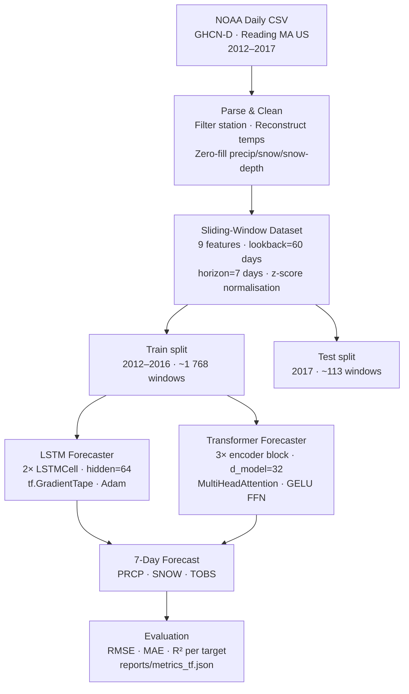
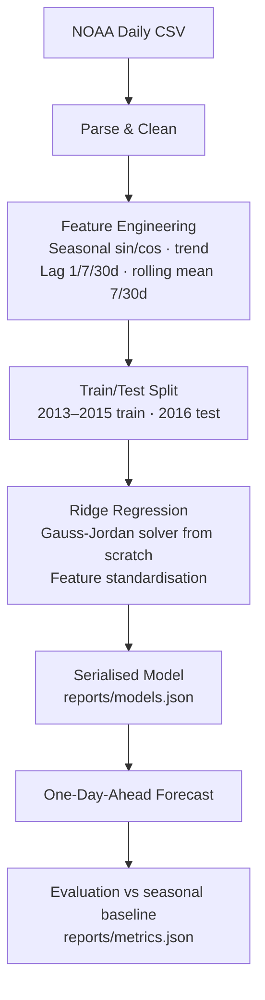

# ML Climate Modeling

[](pyproject.toml)
[](requirements.txt)
[](LICENSE)
[](tests)

Forecasting Boston-area daily weather from NOAA station data across two complete
ML pipelines: a from-scratch Ridge regression baseline and a pure-TensorFlow
deep-learning stack featuring a stacked **LSTM** and a **Transformer encoder**
for 7-day multi-step forecasting.

## Project Goal

Predict three daily weather variables for Reading, Massachusetts (a Boston suburb)
using 6 years of NOAA station history:

| Variable | Description |
|---|---|
| `TOBS` | Observed daily temperature (°F) |
| `PRCP` | Daily precipitation (inches) |
| `SNOW` | Daily snowfall (inches) |

**v0.1** uses 2013–2015 for training and 2016 for testing (one-day-ahead ridge
regression, stdlib-only).  
**v0.2** uses 1960–2017 for training (58 years, 20 974 windows) and 2018–2019
for testing, with 7-day multi-output deep learning models built from raw
TensorFlow ops.

## Key Features

- **Two full pipelines** — Ridge baseline (zero dependencies) + pure-TF deep learning
- NOAA CSV parsing, missing-value handling, and calendar-based train/test splits
- Sliding-window sequence dataset with z-score normalisation (train stats only)
- **LSTM** — 2-layer stacked, unrolled with `tf.unstack`, trained via `tf.GradientTape`
- **Transformer** — pre-norm encoder with sinusoidal positional encoding and `MultiHeadAttention`, all built from `tf.Variable` / `tf.linalg` — no `tf.keras` anywhere
- Custom **Adam optimiser** with bias-corrected moment estimates (`tf.Variable`)
- 7-day multi-output forecasting: PRCP, SNOW, and TOBS predicted jointly
- Early stopping on temporal validation split; gradient clipping (`tf.clip_by_global_norm`)
- Weight serialisation to JSON for inference without retraining
- Exploratory Jupyter notebook with loss curves, attention heatmaps, and model comparison
- 56/56 unit tests across data, models, sequence windowing, and TF primitives

## Results

### Ridge Regression (v0.1 — 1-day-ahead, 2016 test)

Metrics saved to [`reports/metrics.json`](reports/metrics.json).

| Target | Seasonal Naive RMSE | Ridge RMSE | Ridge MAE | Ridge R² |
|---|---:|---:|---:|---:|
| PRCP | 0.304 | 0.259 | 0.153 | −0.025 |
| SNOW | 0.934 | 0.717 | 0.318 | −0.034 |
| TOBS | 10.661 | 8.171 | 6.239 | **0.747** |

Temperature forecasting (R² = 0.747) is strong. Precipitation and snowfall are
sparse, event-driven processes — Ridge beats the seasonal baseline on RMSE but
lag/seasonality features alone cannot capture storm timing.

### Deep Learning (v0.2 — 7-day-ahead multi-step, 2018–2019 test)

Trained on **1960–2017** (58 years, 20 974 sliding windows). Metrics saved to
[`reports/metrics_tf.json`](reports/metrics_tf.json).
Results are averaged across **all 7 forecast horizons** (days 1–7 ahead) and
all 717 test windows.

| Target | LSTM RMSE | LSTM R² | Transformer RMSE | Transformer R² |
|---|---:|---:|---:|---:|
| PRCP | 0.341 | −0.003 | 0.341 | −0.005 |
| SNOW | 1.256 | +0.014 | 1.272 | −0.010 |
| TOBS | 10.535 | +0.639 | **9.718** | **+0.693** |

The Transformer outperforms the LSTM on temperature (R² 0.693 vs 0.639),
suggesting its attention mechanism captures longer-range seasonal structure
better than recurrent state. Both models converged with early stopping
(LSTM epoch 17 · Transformer epoch 25). PRCP and SNOW R² near zero is
expected — precipitation is a sparse, event-driven process that resists
pure sequence-to-sequence regression.

> **Note on comparability:** Ridge predicts **1 day ahead** on the 2016 test
> set. LSTM and Transformer predict **days 1–7 ahead simultaneously** on
> 2018–2019 — a harder task where errors accumulate with horizon. For a
> direct 1-day-ahead comparison run
> `scripts/train_tf_models.py --horizon 1`.

### Forecast Figures


- [PRCP actual vs predicted](reports/figures/prcp_actual_vs_predicted.svg)
- [SNOW actual vs predicted](reports/figures/snow_actual_vs_predicted.svg)
- [TOBS actual vs predicted](reports/figures/tobs_actual_vs_predicted.svg)
- [LSTM loss curve](reports/figures/lstm_loss_curve.svg) *(generated by `make train-tf`)*
- [Transformer loss curve](reports/figures/transformer_loss_curve.svg) *(generated by `make train-tf`)*

## Architecture

### Deep learning pipeline



### Ridge regression pipeline



## Repository Layout

```text
ml-boston-climate-modeler/
├── 962598.csv                        NOAA daily weather export (Reading MA US)
├── src/climate_modeling/
│   ├── data.py                       CSV loading, cleaning, train/test split
│   ├── features.py                   Lag + seasonal features for Ridge pipeline
│   ├── models.py                     RidgeRegressor + SeasonalNaiveModel (stdlib)
│   ├── metrics.py                    MAE, RMSE, R²
│   ├── train.py                      Ridge training CLI
│   ├── visualize.py                  SVG chart generation
│   ├── sequence_dataset.py           Sliding-window builder + SequenceScaler
│   ├── tf_cells.py                   LSTMCell · LayerNorm · MultiHeadAttention
│   │                                 FeedForward · AdamOptimizer  (pure TF)
│   ├── tf_models.py                  LSTMForecaster · TransformerForecaster
│   └── tf_trainer.py                 GradientTape loop · evaluate · save/load weights
├── scripts/
│   ├── train_model.py                Ridge training entrypoint
│   └── train_tf_models.py            LSTM + Transformer training entrypoint
├── notebooks/
│   └── climate_exploration.ipynb     EDA · loss curves · attention heatmaps
├── tests/
│   ├── test_data.py                  Data loading & cleaning (5 tests)
│   ├── test_models.py                Ridge & baseline (10 tests)
│   ├── test_pipeline.py              Feature construction & splits (4 tests)
│   ├── test_visualize.py             SVG generation (3 tests)
│   ├── test_sequence_dataset.py      Windowing & scaler (10 tests)
│   └── test_tf_models.py             TF primitives & models (24 tests)
└── reports/
    ├── metrics.json                  Ridge results
    ├── metrics_tf.json               Deep learning results (generated)
    ├── models.json                   Serialised Ridge weights
    ├── weights_lstm.json             Serialised LSTM weights (generated)
    ├── weights_transformer.json      Serialised Transformer weights (generated)
    └── figures/                      SVG charts
```

## Reproduce

### Setup

```bash
pip install tensorflow>=2.14.0 numpy>=1.24.0
pip install -e .
```

The Ridge pipeline has no external dependencies and continues to run with the
Python standard library only.

### Run all tests

```bash
make test
# or
python3 -m unittest discover -s tests
```

```
Ran 56 tests in 0.15s
OK
```

### Train Ridge baseline (v0.1)

```bash
make train
# or
python3 scripts/train_model.py
```

Custom date range:

```bash
python3 scripts/train_model.py \
  --train-start 2013-01-01 --train-end 2015-12-31 \
  --test-start  2016-01-01 --test-end  2016-12-31
```

### Train LSTM + Transformer (v0.2)

```bash
make train-tf
# or
python3 scripts/train_tf_models.py
```

Available options:

```
--lookback   INT    Input window length in days   [60]
--horizon    INT    Forecast horizon in days       [7]
--epochs     INT    Maximum training epochs        [150]
--batch-size INT    Mini-batch size                [32]
--lr         FLOAT  Adam learning rate             [1e-3]
--patience   INT    Early-stopping patience        [15]
--no-lstm          Skip LSTM training
--no-transformer   Skip Transformer training
--reports-dir DIR  Output directory               [reports]
```

### Reusing trained weights

```python
from climate_modeling.data import load_station_records, parse_iso_date
from climate_modeling.sequence_dataset import build_sequence_dataset
from climate_modeling.tf_models import LSTMForecaster
from climate_modeling.tf_trainer import load_weights, evaluate_model

records = load_station_records("962598.csv")
X_tr, y_tr, X_te, y_te, scaler = build_sequence_dataset(
    records,
    train_start=parse_iso_date("2012-01-01"),
    train_end=parse_iso_date("2016-12-31"),
    test_start=parse_iso_date("2017-01-01"),
    test_end=parse_iso_date("2017-12-31"),
)

lstm = LSTMForecaster(hidden_size=64, n_layers=2, horizon=7)
load_weights(lstm, "reports/weights_lstm.json")

metrics, predictions = evaluate_model(lstm, X_te, y_te, scaler)
```

### Exploratory notebook

```bash
pip install matplotlib jupyterlab
jupyter lab notebooks/climate_exploration.ipynb
```

The notebook covers EDA, training loss curves, attention weight heatmaps for
each Transformer encoder block, and a side-by-side comparison of all four
models.

## Tech Stack

| Layer | Tools |
|---|---|
| Language | Python 3.10+ |
| Deep learning | TensorFlow 2.14+ — `tf.Module`, `tf.Variable`, `tf.GradientTape`, `tf.linalg`, `tf.nn` |
| Baseline | Ridge regression + Gauss-Jordan solver (Python stdlib) |
| Data | `csv`, `dataclasses`, `statistics` (stdlib) |
| Reporting | Hand-rolled SVG, JSON metrics/weight exports |
| Testing | `unittest` (stdlib) |
| Notebook | Jupyter, Matplotlib |

No `tf.keras` API is used in any model, optimiser, or training code.

## License

This project is licensed under the Apache License 2.0. See
[`LICENSE`](LICENSE) for the full license text.
