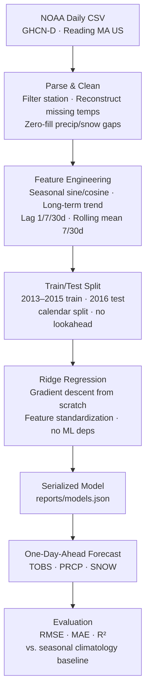

# ML Climate Modeling

[](pyproject.toml)
[](LICENSE)
[](requirements.txt)
[](tests)

Forecasting Boston-area daily weather from NOAA station data with a clean,
reproducible Python ML pipeline.

This repository is a polished, Python-first machine-learning project with data
cleaning, feature engineering, baseline comparison, model training, metrics,
tests, and generated figures.

## Project Goal

The goal is to model local weather patterns for Reading, Massachusetts, a Boston
suburb, using historical daily observations from NOAA. The project predicts:

- `PRCP`: daily precipitation
- `SNOW`: daily snowfall
- `TOBS`: observed daily temperature

The experiment uses 2013-2015 as the training window and calendar year 2016 as
the test window.

## Key Features

- Reproducible Python training pipeline with no third-party runtime dependency.
- NOAA CSV parsing, missing-value handling, and calendar-based train/test split.
- Seasonal features, lag features, and rolling weather-history features.
- Ridge regression implemented from scratch with feature standardization.
- Seasonal climatology baseline for honest model comparison.
- Model serialization (`reports/models.json`) for reuse without retraining.
- Saved metrics and SVG plots for GitHub-friendly reporting.
- Unit tests for modeling, metrics, splitting, feature construction, and
  serialization.

## Results

Latest generated metrics are saved in
[`reports/metrics.json`](reports/metrics.json).

| Target | Baseline RMSE | Ridge RMSE | Ridge MAE | Ridge R2 |
| --- | ---: | ---: | ---: | ---: |
| PRCP | 0.304 | 0.259 | 0.153 | -0.025 |
| SNOW | 0.934 | 0.717 | 0.318 | -0.034 |
| TOBS | 10.661 | 8.171 | 6.239 | 0.747 |

The strongest result is temperature forecasting: the ridge model explains about
75% of the 2016 observed-temperature variance. Precipitation and snowfall are
harder because they are sparse, event-driven processes; the ridge model improves
RMSE over the seasonal baseline, but low R2 shows that local lag/seasonality
features alone do not capture storm timing.

### Test Suite

```bash
$ python3 -m unittest discover -s tests
----------------------------------------------------------------------
Ran 22 tests in 0.005s

OK
```

22/22 tests pass, covering data cleaning, feature engineering, model fitting,
metrics, SVG report generation, and model serialization round-trips.

### Forecast Figures


Additional generated charts:

- [`PRCP actual vs predicted`](reports/figures/prcp_actual_vs_predicted.svg)
- [`SNOW actual vs predicted`](reports/figures/snow_actual_vs_predicted.svg)
- [`TOBS actual vs predicted`](reports/figures/tobs_actual_vs_predicted.svg)

## Methodology



The maintained Python workflow is in [`src/climate_modeling`](src/climate_modeling).

1. Load the NOAA CSV export and filter to `READING MA US`.
2. Replace missing precipitation/snow observations with zero.
3. Reconstruct missing temperatures from available high, low, and observed
   temperature values, then fill any remaining gaps with same-day climatology.
4. Build one-day-ahead supervised features:
   - annual and semiannual sine/cosine seasonality
   - long-term trend
   - 1-day, 7-day, and 30-day lags
   - 7-day and 30-day rolling means
5. Train a ridge regression model for each target.
6. Compare against a seasonal day-of-year baseline.
7. Save metrics, fitted models, and plots under `reports/`.

## Reproduce

This project runs with the Python standard library only.

```bash
python3 -m unittest discover -s tests
python3 scripts/train_model.py
```

Optional package-style execution:

```bash
PYTHONPATH=src python3 -m climate_modeling.train
```

You can also change the station or train/test windows:

```bash
python3 scripts/train_model.py \
  --station "READING MA US" \
  --train-start 2013-01-01 \
  --train-end 2015-12-31 \
  --test-start 2016-01-01 \
  --test-end 2016-12-31
```

### Reusing Trained Models

Training saves fitted models to [`reports/models.json`](reports/models.json),
so you can load them for inference without retraining:

```python
from climate_modeling.train import load_models
from climate_modeling.features import build_supervised_dataset

models = load_models("reports/models.json")
dataset = build_supervised_dataset(records, "TOBS", start, end)
predictions = models["TOBS"]["ridge"].predict(dataset.features)
```

## Tech Stack

- **Language:** Python 3.10+ (standard library only — `csv`, `dataclasses`,
  `statistics`, `math`, `json`, `argparse`)
- **Modeling:** Ridge regression and Gauss-Jordan linear solver implemented
  from scratch
- **Reporting:** Hand-rolled SVG chart generation, JSON metrics/model exports
- **Testing:** `unittest` (standard library)

## Repository Layout

```text
.
├── 962598.csv                  # NOAA daily weather export
├── src/climate_modeling/        # Maintained Python ML package
├── scripts/train_model.py       # Repo-root training entrypoint
├── tests/                       # Unit tests
├── reports/                     # Generated metrics, models, and SVG figures
└── pyproject.toml               # Python project metadata
```

## License

This project is licensed under the Apache License 2.0. See
[`LICENSE`](LICENSE) for the full license text.
