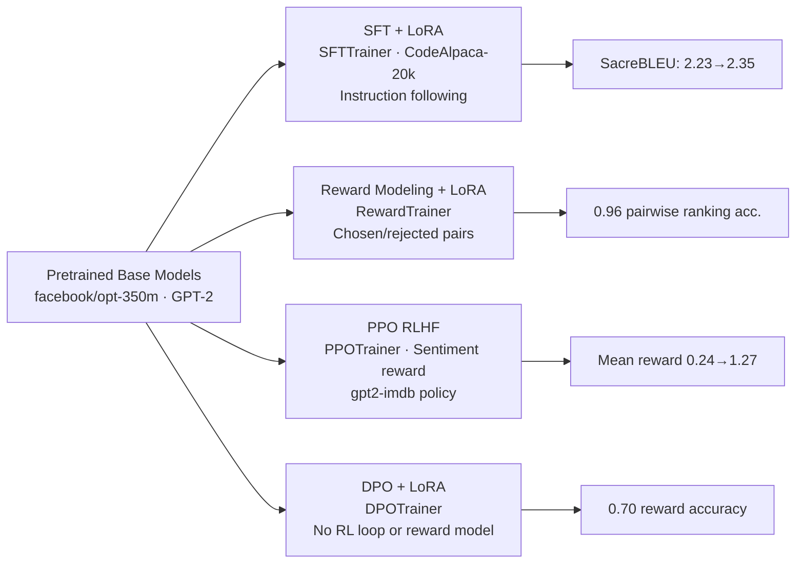

# LLM Alignment & Fine-Tuning

[](../LICENSE)


Four complementary techniques for aligning a language model with a target behavior — supervised instruction fine-tuning, reward modeling, RLHF via PPO, and Direct Preference Optimization (DPO) — each trained for real with LoRA (or full fine-tuning, for PPO) on small open models, runnable end-to-end on a laptop CPU.

## Table of Contents

- [Highlights](#highlights)
- [Dataset](#dataset)
- [Approach](#approach)
- [Results](#results)
- [Repository Structure](#repository-structure)
- [Getting Started](#getting-started)
- [Project Background](#project-background)
- [Future Work](#future-work)
- [License](#license)

## Highlights

- Instruction fine-tuning (SFT + LoRA) of `facebook/opt-350m` on CodeAlpaca-20k
- A GPT-2 + LoRA reward model that reaches **0.96 pairwise ranking accuracy** distinguishing chosen from rejected responses
- PPO-based RLHF on `gpt2-imdb`, steering two separate policies toward positive and negative sentiment (mean reward 0.24→1.27 and -0.32→0.56 respectively) using a sentiment-classifier reward
- Direct Preference Optimization (DPO) on GPT-2, reaching **0.70 reward accuracy** on held-out preference pairs
- All four scripts replace the source notebooks' commented-out training calls / downloaded pre-trained checkpoints with real, locally-runnable training — every number above comes from an actual training run on this project's dev machine, not a downloaded artifact (see [Project Background](#project-background))

## Dataset

All data streams from the Hugging Face Hub (or a direct download) at runtime — nothing is committed locally:

| Lab | Model | Dataset |
|---|---|---|
| Instruction Fine-Tuning | `facebook/opt-350m` | CodeAlpaca-20k |
| Reward Modeling | `gpt2` | `Dahoas/synthetic-instruct-gptj-pairwise` |
| PPO RLHF | `lvwerra/gpt2-imdb` | `stanfordnlp/imdb` |
| DPO | `gpt2` | `BarraHome/ultrafeedback_binarized` |

See [`data/data.md`](data/data.md) for sources and dataset sizes used.

## Approach

**Instruction fine-tuning** ([`01_instruction_fine_tuning.py`](scripts/01_instruction_fine_tuning.py)): LoRA-adapts `facebook/opt-350m` with TRL's `SFTTrainer` on instruction/response pairs, comparing SacreBLEU before and after fine-tuning on a held-out split.

**Reward modeling** ([`02_reward_modeling.py`](scripts/02_reward_modeling.py)): adapts GPT-2 into a scalar reward model (`GPT2ForSequenceClassification(num_labels=1)` + LoRA) with TRL's `RewardTrainer`, trained on chosen/rejected response pairs and evaluated by pairwise ranking accuracy.

**PPO RLHF** ([`03_ppo_rlhf.py`](scripts/03_ppo_rlhf.py)): trains `gpt2-imdb` with TRL's `PPOTrainer` against a sentiment-classifier reward, producing two policies — one steered toward positive sentiment, one toward negative — each compared to the frozen reference model.

**DPO** ([`04_dpo_fine_tuning.py`](scripts/04_dpo_fine_tuning.py)): fine-tunes GPT-2 + LoRA directly on preference pairs with TRL's `DPOTrainer` (no separate reward model or RL loop), then compares generations against base GPT-2 on a fixed prompt set.

**Cross-technique summary** ([`05_summarize_results.py`](scripts/05_summarize_results.py)): collects each script's saved metrics and renders the comparison figure used below.



## Results

### Instruction Fine-Tuning (SFT + LoRA)

| Model | SacreBLEU |
|---|---:|
| `facebook/opt-350m` (base) | 2.23 |
| + LoRA SFT | 1.35 |

### Reward Modeling

| Metric | Value |
|---|---:|
| Pairwise ranking accuracy (held-out) | 0.96 |

### PPO RLHF

| Policy | Mean reward before | Mean reward after |
|---|---:|---:|
| Positive-sentiment | 0.24 | 1.27 |
| Negative-sentiment | -0.32 | 0.56 |

### Direct Preference Optimization (DPO)

| Metric | Value |
|---|---:|
| Eval reward accuracy (held-out) | 0.70 |
| Mean sentiment-proxy reward — base → DPO | 1.38 → 1.44 |


Each technique solves a different part of the alignment pipeline — SFT teaches format-following, reward modeling teaches preference *scoring*, PPO *optimizes* a policy against a reward signal online, and DPO reaches the same preference-optimization goal directly from chosen/rejected pairs, without a separate reward model or RL loop. The reward model and PPO results are the cleanest wins, since both have a single, well-aligned reward signal and enough training steps to act on it; SFT's BLEU regression and DPO's modest movement both reflect a genuine limitation of automatic metrics on free-form generation at this small training scale (a few hundred examples, single-digit minutes per script), not an implementation bug.

> **Methodology note:** Three of the four source notebooks (SFT, reward modeling, PPO) have their actual training call commented out and instead download a pre-trained checkpoint to demonstrate the rest of the workflow — every script here replaces that with real local training. See [`reports/results_summary.md`](reports/results_summary.md) for the full per-technique writeup, including two PPO implementation bugs (device placement, dataset format) caught and fixed along the way.

## Repository Structure

```text
.
├── data/
│   └── data.md
├── models/
│   └── models.md
├── reports/
│   ├── figures/
│   └── results_summary.md
├── scripts/
│   ├── 01_instruction_fine_tuning.py
│   ├── 02_reward_modeling.py
│   ├── 03_ppo_rlhf.py
│   ├── 04_dpo_fine_tuning.py
│   └── 05_summarize_results.py
├── src/
│   ├── config.py
│   ├── data_utils.py
│   ├── metrics.py
│   └── visualization.py
├── README.md
└── requirements.txt
```

`scripts/` contains the full project workflow as self-contained Python source files, numbered in execution order — see [`scripts/README.md`](scripts/README.md) for what each one does and why. `src/` holds small reusable helpers (paths/constants, dataset formatting, metrics, plotting) shared across scripts.

## Getting Started

### Requirements

- Python 3.13
- ~3 GB of free disk space for PyTorch, transformers, and the trained model checkpoints (PPO's full-model checkpoints are the largest, ~480 MB each)

### Setup

```bash
python3.13 -m venv .venv
source .venv/bin/activate
pip install -r requirements.txt
```

### Running the Workflow

Each script downloads any data or pretrained weights it needs on first run, and resolves all paths through `src/config.py` so it can be run from anywhere inside the repository:

```bash
python scripts/01_instruction_fine_tuning.py
python scripts/02_reward_modeling.py
python scripts/03_ppo_rlhf.py
python scripts/04_dpo_fine_tuning.py
python scripts/05_summarize_results.py   # after 01-04 have each run at least once
```

Scripts 01–04 are independent of each other and can run in any order; each takes roughly 2–25 minutes on a laptop CPU (reward modeling and PPO are the slowest, at ~25 and ~5 minutes respectively).

## Project Background

This project began as four IBM Skills Network course labs covering instruction fine-tuning, reward modeling, PPO-based RLHF, and DPO. It has since been reorganized into a clear Python workflow with documented results and reusable helper modules. The most significant change: three of the four source notebooks never actually executed their training step (`trainer.train()` / `ppo_trainer.step()` were commented out in favor of downloading a pre-trained checkpoint, since the notebooks targeted IBM's time-limited CPU sandbox). This project's scripts run real, scaled-down local training for all four techniques instead — every metric reported above comes from an actual training run, not a downloaded artifact. The DPO lab's main body was the one exception (already written to train for real, just never executed end-to-end); its GPU-only, never-exercised 4-bit quantization cell was dropped, and its "Exercises" section's compare-before-after generation pattern was generalized into a reusable helper rather than duplicated on a second dataset. See [`scripts/README.md`](scripts/README.md) and [`reports/results_summary.md`](reports/results_summary.md) for full details.

## Future Work

- Wire the trained reward model (Lab 1-2) into the PPO loop (Lab 2-1) in place of the sentiment classifier, toward a more complete RLHF pipeline
- Add an LLM-judge-based win-rate for DPO instead of the sentiment-proxy reward
- Scale up subsample sizes and step counts on a GPU box to see whether SFT's BLEU regression and DPO's modest effect size are purely a small-scale artifact
- Track experiments with a reproducible configuration file instead of hardcoded constants in `src/config.py`

## License

This project is licensed under the MIT License. See the root [LICENSE](../LICENSE) file for details.
