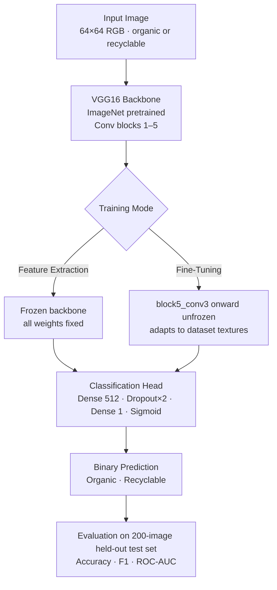

# Recyclable Material Classification with VGG16 Transfer Learning

[](../LICENSE)


Binary classification of images into **organic material** and **recyclable material** categories using VGG16 transfer learning, implemented in two configurations: a frozen feature-extraction model and a model fine-tuned from `block5_conv3` onward, with both evaluated on a held-out test set.

## Table of Contents

- [Highlights](#highlights)
- [Dataset](#dataset)
- [Approach](#approach)
- [Results](#results)
- [Repository Structure](#repository-structure)
- [Getting Started](#getting-started)
- [Project Background](#project-background)
- [Future Work](#future-work)
- [License](#license)

## Highlights

- Binary material classification on a balanced, 1,200-image dataset
- Two VGG16 transfer-learning configurations compared head-to-head: frozen feature extraction vs. fine-tuning the top convolutional block
- Full evaluation suite: accuracy, precision, recall, F1, ROC-AUC, and confusion matrices on the complete held-out test set
- Caught and fixed a data-handling bug in the original course notebook: a mislabeled generator meant every original training run actually trained on test-directory images (see [Results](#results))

## Dataset

The dataset contains 1,200 JPG images, balanced across two classes:

| Class | Meaning | Images |
|---|---|---:|
| `O` | Organic material | 600 |
| `R` | Recyclable material | 600 |

The data pipeline downloads the archive automatically from IBM Skills Network cloud storage:

```text
https://cf-courses-data.s3.us.cloud-object-storage.appdomain.cloud/kd6057VPpABQ2FqCbgu9YQ/o-vs-r-split-reduced-1200.zip
```

Large local data files are kept out of Git. See [`data/data.md`](data/data.md) for setup notes.

## Approach

**Feature extraction** ([`02_vgg16_feature_extraction_model.py`](scripts/02_vgg16_feature_extraction_model.py)): an ImageNet-pretrained VGG16 convolutional base, fully frozen, feeding a small dense classification head (`Dense(512)` → `Dropout(0.3)` ×2 → `Dense(1, sigmoid)`). Trained with RMSprop, an exponential learning-rate decay schedule, and early stopping on validation loss.

**Fine-tuning** ([`03_vgg16_fine_tuned_model.py`](scripts/03_vgg16_fine_tuned_model.py)): the same architecture, but with the convolutional base unfrozen from `block5_conv3` onward, letting the top of the backbone adapt to this dataset's textures while keeping earlier, more generic layers frozen.

Both models train on an 800-image training split with on-the-fly augmentation (width/height shift, horizontal flip) and a 200-image validation split, then get evaluated together in [`04_evaluate_models.py`](scripts/04_evaluate_models.py) on the full 200-image held-out test set.



## Results

| Model | Accuracy | Precision | Recall | F1 Score | ROC-AUC |
|---|---:|---:|---:|---:|---:|
| VGG16 Feature-Extraction | 0.8650 | 0.9195 | 0.8000 | 0.8556 | 0.9332 |
| VGG16 Fine-Tuned | 0.8650 | 0.8842 | 0.8400 | 0.8615 | 0.9534 |

Both models reach the same overall test accuracy, but fine-tuning the top convolutional block improves ranking quality (ROC-AUC) and balances precision/recall more evenly across classes.

> **Methodology note:** The source course notebook had a bug where the cell intended to create a `test_generator` instead reassigned `train_generator` to the test directory — every original training run was therefore fit on test-directory images, masked by a toy `steps_per_epoch=5` run that nobody scrutinized closely. This project's scripts build three separate, correctly named generators, and the numbers above come from real training runs (30 epochs for feature extraction, 20 for fine-tuning, both with early stopping) evaluated on the complete 200-image test set, not the original's 100-image subsample. See [`reports/results_summary.md`](reports/results_summary.md) for the full writeup.

## Repository Structure

```text
.
├── data/
│   └── data.md
├── models/
│   └── models.md
├── reports/
│   ├── figures/
│   └── results_summary.md
├── scripts/
│   ├── 01_data_pipeline.py
│   ├── 02_vgg16_feature_extraction_model.py
│   ├── 03_vgg16_fine_tuned_model.py
│   └── 04_evaluate_models.py
├── src/
│   ├── config.py
│   ├── data_utils.py
│   ├── metrics.py
│   └── visualization.py
├── README.md
└── requirements.txt
```

`scripts/` contains the full project workflow as self-contained Python source files, numbered in execution order — see [`scripts/README.md`](scripts/README.md) for what each one does. `src/` holds small reusable helpers (paths, metrics, plotting) shared across scripts.

## Getting Started

### Requirements

- Python 3.13
- ~1 GB of free disk space for TensorFlow and its dependencies

### Setup

```bash
python3.13 -m venv .venv
source .venv/bin/activate
pip install -r requirements.txt
```

### Running the Workflow

Each script downloads any data or pretrained weights it needs on first run. Scripts resolve all paths through `src/config.py`, so they can be run from anywhere inside the repository:

```bash
python scripts/01_data_pipeline.py
python scripts/02_vgg16_feature_extraction_model.py
python scripts/03_vgg16_fine_tuned_model.py
python scripts/04_evaluate_models.py
```

Scripts are numbered in execution order; `04` expects the trained model artifacts from `02` and `03` to exist first.

## Project Background

This project began as an IBM/Coursera "AI Capstone Project with Deep Learning" course assignment. It has since been reorganized into a clear Python workflow with documented results, reusable helper modules, proper handling of large data and model artifacts, real (non-toy) training runs, and a fixed data-generator bug from the original notebook (see [Results](#results)).

## Future Work

- Fine-tune additional convolutional blocks (e.g. from `block4_conv1`) to see if ranking quality improves further
- Add Grad-CAM visualizations to inspect which image regions drive each model's predictions
- Package the best model behind a small Streamlit or Gradio demo for interactive classification
- Track experiments with a reproducible configuration file instead of hardcoded script constants

## License

This project is licensed under the MIT License. See the root [LICENSE](../LICENSE) file for details.
