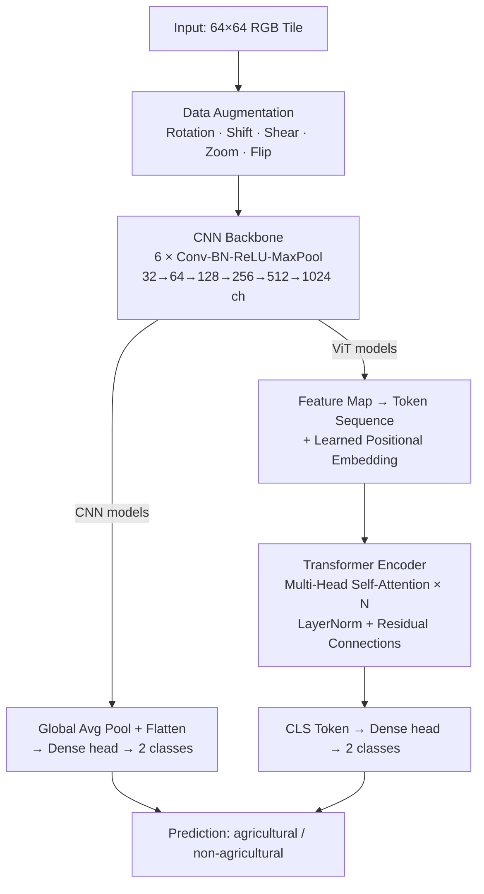
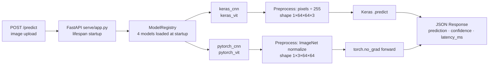

# Satellite Land Classification with CNNs and Vision Transformers


Binary classification of satellite image tiles as **agricultural** or **non-agricultural** land, implemented end-to-end in both Keras/TensorFlow and PyTorch. The project progresses from data-loading experiments through CNN baselines to CNN–Vision Transformer hybrids that combine local feature extraction with global attention, with parallel evaluation across both frameworks at every stage.

## Table of Contents

- [Highlights](#highlights)
- [Dataset](#dataset)
- [Approach](#approach)
- [Results](#results)
- [Inference Server](#inference-server)
- [Repository Structure](#repository-structure)
- [Getting Started](#getting-started)
- [Project Background](#project-background)
- [Future Work](#future-work)
- [License](#license)

## Highlights

- Binary land-use classification on a balanced, 6,000-image satellite tile dataset
- Parallel Keras and PyTorch implementations for data pipelines, CNN baselines, and CNN-ViT hybrids
- Cross-framework evaluation using accuracy, precision, recall, F1, ROC-AUC, loss, and confusion matrices
- Held-out validation methodology: an earlier version of this project scored models against the full training set; the evaluation pipeline was corrected to score only each model's untouched validation split (see [Results](#results))
- FastAPI inference server serving all four models via a `?model=` query parameter, with Docker Compose for one-command deployment

## Dataset

The dataset contains 6,000 JPG satellite tiles, balanced across two classes:

| Class | Meaning | Images |
|---|---|---:|
| `class_0_non_agri` | Non-agricultural land | 3,000 |
| `class_1_agri` | Agricultural land | 3,000 |

The data pipeline downloads the archive automatically from IBM Skills Network cloud storage:

```text
https://cf-courses-data.s3.us.cloud-object-storage.appdomain.cloud/4Z1fwRR295-1O3PMQBH6Dg/images-dataSAT.tar
```

Large local data files are kept out of Git. See [`data/data.md`](data/data.md) for setup notes.

## Approach

**CNN baseline** ([`04_keras_cnn_classifier.py`](scripts/04_keras_cnn_classifier.py), [`05_pytorch_cnn_classifier.py`](scripts/05_pytorch_cnn_classifier.py)): six convolutional blocks (32 → 1024 channels, 5×5 kernels with ReLU, max-pooling, and batch normalization) followed by global average pooling and a dense classification head. Trained with Adam and on-the-fly augmentation (rotation, shift, shear, zoom, horizontal flip).

**CNN-ViT hybrid** ([`07_keras_cnn_vit_hybrid.py`](scripts/07_keras_cnn_vit_hybrid.py), [`08_pytorch_cnn_vit_hybrid.py`](scripts/08_pytorch_cnn_vit_hybrid.py)): reuses the trained CNN's convolutional backbone as a feature extractor, flattens its output feature map into a token sequence, adds learned positional embeddings, and feeds the tokens through a multi-head self-attention Transformer encoder before a classification head. This combines the CNN's local texture sensitivity with the Transformer's ability to model longer-range spatial relationships — useful for land-use imagery where field boundaries and broader layout patterns matter alongside fine-grained texture.

### Model Architecture



Both CNN and ViT paths are implemented independently in **Keras/TensorFlow** and **PyTorch** — four models total.

### Inference Server Architecture



## Results

| Model | Accuracy | Precision | Recall | F1 Score | ROC-AUC |
|---|---:|---:|---:|---:|---:|
| Keras CNN | 0.9933 | 1.0000 | 0.9867 | 0.9933 | 1.0000 |
| PyTorch CNN | 0.9983 | 0.9965 | 1.0000 | 0.9983 | 1.0000 |
| Keras CNN-ViT Hybrid | 0.9942 | 0.9966 | 0.9917 | 0.9942 | 0.9991 |
| PyTorch CNN-ViT Hybrid | 0.9967 | 0.9983 | 0.9950 | 0.9967 | 0.9999 |

The PyTorch models edged out their Keras counterparts in these runs, with the PyTorch CNN-ViT hybrid reaching 99.67% held-out accuracy.

> **Methodology note:** These numbers come from evaluating each model on its held-out validation split only (1,200 images, 20% of `images_dataSAT`) — the same split reserved during training and never seen by that model's weights. See [`reports/results_summary.md`](reports/results_summary.md) for the full writeup, including how that split is reconstructed and an earlier methodology issue (full-dataset evaluation leaking training images into the metrics) that this corrects.

## Inference Server

A FastAPI server in `serve/` loads all four trained models at startup and exposes three endpoints:

| Endpoint | Method | Description |
|---|---|---|
| `/health` | GET | Server status, loaded models, uptime |
| `/models` | GET | All four models with availability flags |
| `/predict` | POST | Classify an image; select model via `?model=` |

Supported `model` values: `pytorch_vit` (default), `pytorch_cnn`, `keras_vit`, `keras_cnn`.

### Run with Docker Compose

```bash
# Place trained model weights in models/trained/ first (see models/models.md)
docker compose up --build
```

### Run locally

```bash
pip install -r serve/requirements.txt
uvicorn serve.app:app --host 0.0.0.0 --port 8000
```

### Example request

```bash
# Classify a tile with the PyTorch CNN-ViT hybrid (default)
curl -X POST "http://localhost:8000/predict?model=pytorch_vit" \
     -F "file=@tile.jpg"

# Response
{
  "model": "pytorch_vit",
  "prediction": "agricultural",
  "confidence": 0.9973,
  "class_id": 1,
  "latency_ms": 18.42
}
```

## Repository Structure

```text
.
├── data/
│   └── data.md
├── models/
│   └── models.md
├── reports/
│   ├── figures/
│   └── results_summary.md
├── scripts/
│   ├── 01_data_loading_memory_vs_generator.py
│   ├── 02_keras_data_pipeline.py
│   ├── 03_pytorch_data_pipeline.py
│   ├── 04_keras_cnn_classifier.py
│   ├── 05_pytorch_cnn_classifier.py
│   ├── 06_keras_vs_pytorch_cnn_comparison.py
│   ├── 07_keras_cnn_vit_hybrid.py
│   ├── 08_pytorch_cnn_vit_hybrid.py
│   └── 09_final_cnn_vit_evaluation.py
├── serve/
│   ├── app.py                  # FastAPI application
│   ├── model_registry.py       # Model loading and caching
│   ├── pytorch_models.py       # PyTorch model class definitions
│   ├── keras_custom_layers.py  # Custom Keras layers (auto-registers on import)
│   ├── preprocessing.py        # Per-backend image preprocessing
│   ├── schemas.py              # Pydantic request/response types
│   ├── Dockerfile
│   └── requirements.txt
├── src/
│   ├── config.py
│   ├── data_utils.py
│   ├── metrics.py
│   └── visualization.py
├── docker-compose.yml
├── LICENSE
├── README.md
└── requirements.txt
```

`scripts/` contains the full project workflow as self-contained Python source files, numbered in execution order from data loading through final model evaluation — see [`scripts/README.md`](scripts/README.md) for what each one does. `src/` holds small reusable helpers (paths, metrics, plotting) factored out for future reuse.

## Getting Started

### Requirements

- Python 3.13 — TensorFlow does not yet ship wheels for newer Python releases, so a 3.13 environment is recommended even if a newer interpreter is installed system-wide
- ~2 GB of free disk space for TensorFlow, PyTorch, and their dependencies

### Setup

```bash
python3.13 -m venv .venv
source .venv/bin/activate
pip install -r requirements.txt
```

### Running the Workflow

Each script in `scripts/` is self-contained: it downloads the dataset (and any pretrained weights it needs) on first run, then executes its part of the workflow. Run them from a directory you're happy to have the dataset and downloaded artifacts land in (e.g. `data/raw/`, which is already git-ignored):

```bash
cd data/raw
python ../../scripts/04_keras_cnn_classifier.py
```

Scripts are numbered in the order they were developed; `06` and `09` are the cross-framework comparison/evaluation steps and expect the corresponding training scripts' outputs to exist first.

## Project Background

This project began as an IBM/Coursera deep learning capstone sequence. It has since been reorganized into a clear Python workflow with documented results, reusable helper modules, and proper handling of large data and model artifacts — including catching and fixing a data-leakage bug in the original evaluation methodology (see [Results](#results)).

## Future Work

- Validate on a geographically distinct holdout set, beyond the same-distribution validation split used today
- Add Grad-CAM or attention visualizations for interpretability
- Export selected plots from model runs into `reports/figures/`
- Track experiments with MLflow or Weights & Biases
- Add a batch `/predict/batch` endpoint to the inference server
- Add Prometheus metrics (request count, latency histogram) to the server

## License

This project is licensed under the Apache License 2.0. See [`LICENSE`](LICENSE) for the full license text.
