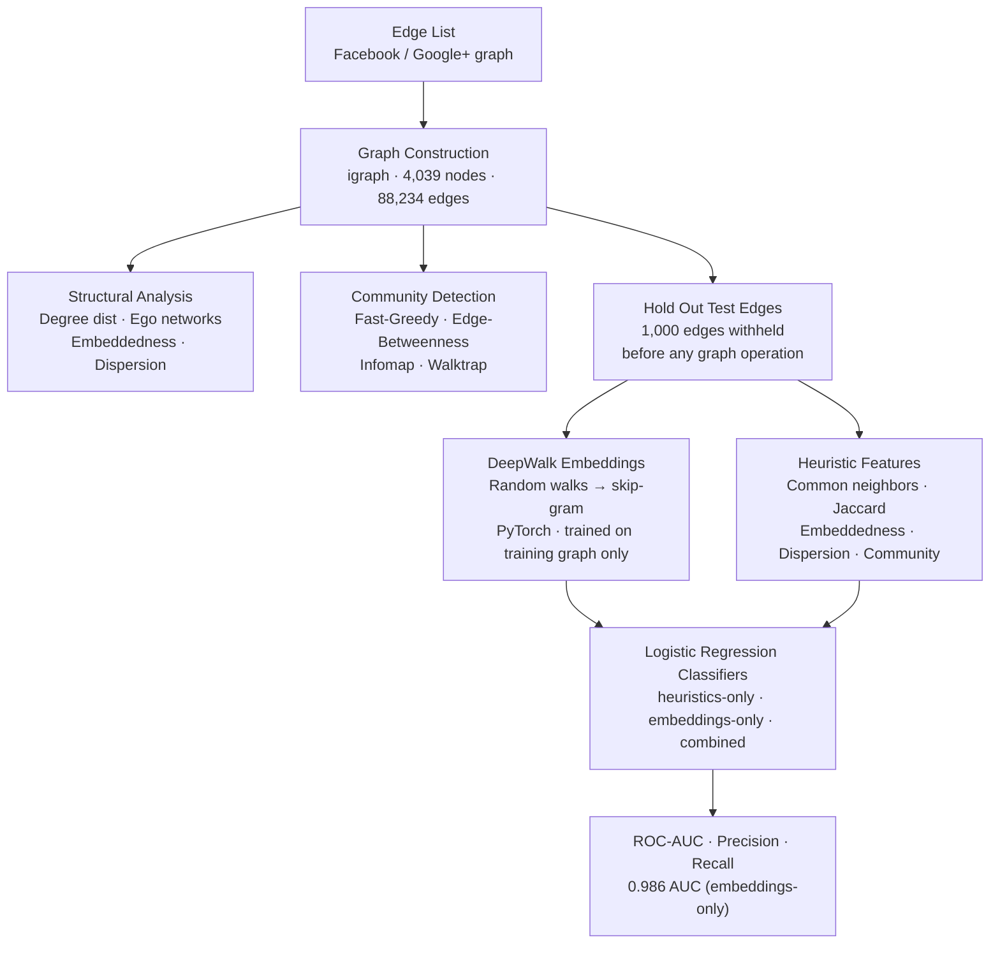

# Community Detection and Link Prediction in Social Networks

This project analyzes large-scale online social networks through the lens of graph theory and machine learning. It uses Facebook and Google+ style social graph data to study how communities form, how influential core users shape local neighborhoods, how algorithmic community detection compares with user-defined groups, and whether learned node embeddings can predict missing friendships better than hand-engineered graph heuristics.

The repository is organized as a reproducible portfolio project. It includes a modular Python analysis pipeline (`python-igraph`), a PyTorch/scikit-learn link-prediction pipeline, small sample data for quick runs, documentation for sourcing the original public datasets, and generated result/figure directories.

## Project Goals

- Measure structural properties of social graphs, including connectivity, diameter, degree distribution, and core nodes.
- Build ego networks around highly connected users to inspect local community structure.
- Compare community detection methods such as Fast-Greedy, Edge-Betweenness, Infomap, and Walktrap.
- Compute social-network metrics such as embeddedness and dispersion.
- Evaluate how detected Google+ communities align with user-defined circles when circle metadata is available.

## Key Techniques

- Graph construction from edge lists
- Degree distribution analysis
- Ego-network extraction
- Core-node identification
- Community detection with `igraph`
- Embeddedness and dispersion scoring
- Community-level summaries using size, density, modularity, clustering coefficient, betweenness, and assortativity
- DeepWalk-style node embeddings trained with a hand-rolled PyTorch skip-gram model
- Link-prediction classifiers (scikit-learn) comparing learned embeddings against the existing graph heuristics



## Link Prediction & Node Embeddings

A second, optional pipeline (`run_link_prediction.py`) extends the structural analysis above into a predictive task: given the graph with some friendships held out, can we predict which pairs of people are actually connected?

- Holds out a random sample of real edges as a test set, without leaking them into training (see [docs/methodology.md](docs/methodology.md) for why this matters).
- Trains node embeddings via random walks (`igraph`) and a skip-gram model with negative sampling (`PyTorch`), trained only on the training graph.
- Engineers features by combining those embeddings with the existing embeddedness, dispersion, common-neighbor, Jaccard, and same-community heuristics.
- Trains and compares three `scikit-learn` logistic-regression classifiers: heuristics-only, embeddings-only, and combined, evaluated by ROC-AUC, precision, and recall.

Run it with:

```bash
python3 run_link_prediction.py
```

Outputs are written to:

- `results/node_embeddings.pkl` — learned per-vertex embedding vectors.
- `results/node_embeddings_model.pt` — trained PyTorch skip-gram model weights.
- `results/link_prediction_classifier.pkl` — the final trained (combined-feature) classifier.
- `results/link_prediction_metrics.csv` — ROC-AUC/precision/recall for each feature-set variant.
- `figures/roc_curve.png` — overlaid ROC curves for the three variants.

### Results (full Facebook dataset)

Running against the full SNAP Facebook graph (4,039 vertices, 88,234 edges, 1,000 held-out test edges):

| Feature set | ROC-AUC | Precision | Recall |
|---|---|---|---|
| Heuristics only (common neighbors, Jaccard, same-community, embeddedness, dispersion) | 0.974 | 0.992 | 0.733 |
| Embeddings only (cosine similarity of learned vectors) | 0.986 | 0.951 | 0.955 |
| Combined | 0.953 | 0.963 | 0.360 |

The embeddings slightly outperform the hand-engineered heuristics on ROC-AUC and recall, but the existing heuristics alone are already strong predictors of real friendships. See [report/case_study.md](report/case_study.md#7-can-learned-embeddings-improve-link-prediction-over-heuristics) for the full writeup, including why the combined model's recall drops at the default 0.5 threshold despite a high AUC.

## Repository Structure

```text
.
├── .gitignore
├── LICENSE
├── README.md
├── requirements.txt
├── run_analysis.py
├── run_link_prediction.py
├── src/python/
│   ├── community_detection.py
│   ├── facebook_analysis.py
│   ├── feature_engineering.py
│   ├── google_plus_analysis.py
│   ├── link_prediction_data.py
│   ├── link_prediction_model.py
│   ├── load_data.py
│   ├── node_embeddings.py
│   └── utils.py
├── data/
│   ├── README.md
│   └── sample/
│       ├── facebook_sample_edges.txt
│       ├── google_plus_sample_circles.txt
│       └── google_plus_sample_edges.txt
├── docs/
│   └── methodology.md
├── figures/
│   └── .gitkeep
├── report/
│   └── case_study.md
└── results/
    └── .gitkeep
```

## Data

The original analysis was designed for public SNAP social-network datasets:

- Facebook combined ego-network edge list
- Google+ ego-network edge and circle files

Large raw datasets are intentionally not committed to this repository. See [data/README.md](data/README.md) for download and placement instructions. The small files in `data/sample/` let the pipeline run quickly and demonstrate the analysis workflow.

## Quick Start

Install the dependencies:

```bash
pip install -r requirements.txt
```

Run the sample analysis:

```bash
python3 run_analysis.py
```

Outputs are written to:

- `results/summary_metrics.csv`
- `results/facebook_core_nodes.csv`
- `results/facebook_ego_communities.csv`
- `results/facebook_ego_social_scores.csv`
- `results/google_plus_circle_scores.csv`
- `figures/facebook_degree_distribution.png`
- `figures/facebook_ego_network.png`

## Running With Full Data

Place full raw data files under `data/raw/`:

```text
data/raw/facebook_combined.txt
data/raw/gplus/
```

Then run:

```bash
python3 run_analysis.py
```

The pipeline automatically uses the full Facebook edge list when `data/raw/facebook_combined.txt` exists; otherwise it falls back to the included sample file.

## Skills Demonstrated

This project demonstrates the ability to:

- Translate real social data into graph representations.
- Design reproducible analytical workflows.
- Compare graph algorithms empirically.
- Communicate technical results through clear metrics, figures, and documentation.
- Engineer ML features from graph structure and train/evaluate predictive models with PyTorch and scikit-learn.

## Limitations

The sample data is intentionally tiny and is only meant to verify the workflow. Meaningful conclusions require the full public datasets. The included `data/sample/google_plus_sample_circles.txt` is a small hand-built file used only to demonstrate the circle-matching workflow; running circle matching on the full Google+ dataset requires the real per-user `.edges` and `.circles` files, not just a combined edge list.

The same caveat applies to the link-prediction pipeline: `data/sample/facebook_sample_edges.txt` (16 vertices, 24 edges) is only large enough to verify `run_link_prediction.py` runs end-to-end and produces well-formed outputs — ROC-AUC and other metrics on it are not statistically meaningful. Run it against the full Facebook dataset (`data/raw/facebook_combined.txt`, see [data/README.md](data/README.md)) for meaningful link-prediction results. The embeddings are also DeepWalk-style uniform random walks, not the literal p/q-biased Node2Vec transition rule.

## License

This project is licensed under the Apache License 2.0. See [LICENSE](LICENSE) for the full license text.
