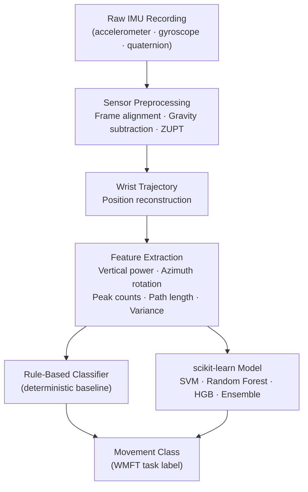

# Upper Body Motion Classifier

[](https://www.python.org/)
[](LICENSE)
[](https://scikit-learn.org/)
[](https://numpy.org/)
[](https://pandas.pydata.org/)
[](https://scipy.org/)

A Python pipeline that classifies upper-body movements from wrist-worn IMU recordings collected during the Wolf Motor Function Test (WMFT). It turns raw accelerometer/gyroscope/quaternion captures into wrist trajectories, extracts motion-shape features, and classifies them with either a deterministic rule-based baseline or trained scikit-learn models.

The system is intended for research and prototyping in rehabilitation monitoring. It is not approved for clinical use.

## What It Does

- Reads AirInterface MPU-9150 text captures with accelerometer, gyroscope, and quaternion columns.
- Aligns the sensor frame, subtracts gravity, applies zero-velocity updates, and reconstructs wrist trajectory.
- Extracts trajectory and motion-shape features such as vertical power, azimuth rotation, peak counts, path length, variance, and acceleration statistics.
- Provides a deterministic rule-based baseline for quick classification before a trained dataset is available.
- Trains tabular ML classifiers using scikit-learn: SVM, random forest, histogram gradient boosting, or a soft-voting ensemble.
- Includes tooling to augment a small real dataset with synthetic variants, and to evaluate those variants without leaking source-trial information across cross-validation folds.

## Pipeline



## Repository Layout

```text
.
├── LICENSE
├── README.md
├── pyproject.toml                # Python package and dependencies
├── requirements.txt              # Runtime dependency list
├── sample_data.txt               # Example raw IMU capture
├── wmft_model.joblib             # Model trained on the author's real + synthetic data
├── examples/
│   └── manifest.example.csv      # Training manifest template
├── scripts/
│   ├── smoke_test.py             # Quick local pipeline smoke test
│   ├── generate_synthetic_data.py # Fabricates IMU data from hand-picked per-class motion parameters
│   ├── augment_real_data.py      # Generates synthetic variants by perturbing real data/ recordings
│   └── evaluate_grouped_cv.py    # Cross-validation that keeps augmented variants grouped by source trial
├── src/wmft_motion/
│   ├── __init__.py               # Public package exports
│   ├── cli.py                    # wmft-motion command line interface
│   ├── constants.py              # WMFT labels and sensor constants
│   ├── features.py               # Feature extraction
│   ├── io.py                     # Sensor text parser
│   ├── models.py                 # ML training and prediction
│   ├── preprocessing.py          # Gravity correction, ZUPT, trajectory
│   ├── quaternion.py             # Quaternion math
│   └── rules.py                  # Rule-based baseline classifier
└── tests/
    ├── test_cli.py                # Command line interface tests
    ├── test_io.py                 # Sensor parser tests
    ├── test_models.py             # ML utility regression tests
    ├── test_preprocessing.py      # Trajectory preprocessing tests
    ├── test_quaternion.py         # Quaternion math tests
    ├── test_rules.py              # Rule-based classifier tests
    └── test_sample_pipeline.py    # Sample data pipeline tests
```

> **Note:** `data/` (real WMFT recordings) and `synthetic_data/` (generated variants) are not committed to this repository — the real recordings are participant data and are excluded for privacy, and the synthetic data is regenerated from them. Both are gitignored locally. The sections below describe the expected layout and show results reproduced on the author's private dataset; the pipeline works the same way against any data you supply in that layout.

## Install

```bash
python3 -m venv .venv
. .venv/bin/activate
pip install -e ".[dev]"
```

## Use The Rule-Based Baseline

The baseline uses hand-tuned trajectory thresholds and is useful before you have enough labeled training data.

```bash
wmft-motion classify-rule sample_data.txt
```

## Extract Features

```bash
wmft-motion extract-features sample_data.txt --json
```

## Train A Machine-Learning Model

Create a labeled manifest CSV with two columns:

```csv
path,label
../recordings/subject01_trial01.txt,1
../recordings/subject01_trial02.txt,WMFT 8: Reach and retrieve
```

Then build features and train:

```bash
wmft-motion build-features examples/manifest.csv features.csv
wmft-motion train features.csv wmft_model.joblib --kind ensemble --evaluate
```

You can also train directly from a manifest:

```bash
wmft-motion train examples/manifest.csv wmft_model.joblib --from-manifest --kind random_forest
```

`--evaluate` runs `StratifiedKFold` cross-validation before the final fit and requires at least two samples in every class. With very small or imbalanced datasets, some classes won't meet that bar — drop `--evaluate` to train anyway, or see the augmentation workflow below.

## Train On Real WMFT Data

If you have your own labeled WMFT recordings, lay them out as `data/<classID>_<task><trial>.txt` with a `data/manifest.csv` (`path,label`) alongside them. On the author's private set of 42 real recordings across 17 movement classes:

```bash
wmft-motion build-features data/manifest.csv real_features.csv
wmft-motion train real_features.csv wmft_model.joblib --kind ensemble
```

Two classes (11 "lift paper clip" and 16 "fold towel") have only one trial each, so `--evaluate` will fail on the full dataset. A 2-fold cross-validation restricted to the other 15 classes lands around **50% accuracy** — informative as a sanity check, but not reliable given 2-4 samples per class.

## Augmenting With Synthetic Data

Two complementary scripts generate synthetic recordings for pipeline testing and dataset expansion:

- `scripts/generate_synthetic_data.py` fabricates motion from hand-picked per-class amplitude/duration parameters. Useful for exercising the pipeline end to end before any real data exists, but the parameters are guesses, not measurements.
- `scripts/augment_real_data.py` is grounded in real data: for each recording in your `data/` directory, it splits the signal into a rest baseline and a motion component, then creates variants by time-warping, gain-scaling, adding sensor noise, and applying a small mounting-angle rotation. This preserves each trial's real motion signature while producing more examples per class.

```bash
python scripts/augment_real_data.py --data-dir data --out-dir synthetic_data --variants-per-trial 10
wmft-motion build-features synthetic_data/manifest.csv synthetic_features.csv
```

**Evaluating augmented data correctly matters.** Variants of the same source trial are highly correlated. The CLI's `train --evaluate` uses plain `StratifiedKFold`, which splits by row and scatters near-duplicate variants across train and test folds — it will report misleadingly high accuracy (we measured 100%) because the model partly memorizes the source trial instead of the movement class. Use the grouped evaluator instead, which keeps every variant of a given real trial on the same side of the split:

```bash
python scripts/evaluate_grouped_cv.py synthetic_features.csv --kind ensemble --folds 5
```

On the author's augmented dataset (420 synthetic recordings from 42 real trials, 10 variants each), this gives:

| Evaluation | Accuracy | Why |
|---|---|---|
| `train --evaluate` (plain `StratifiedKFold`) | 100% | Leaks near-duplicate variants of the same trial across folds |
| `evaluate_grouped_cv.py` (`StratifiedGroupKFold`) | **74%** | Holds out entire source trials; the honest number |

Classes 11 and 16 are excluded from the grouped evaluation (only one source trial each, so there's nothing to hold out). Classes 1, 5, and 13 score worst in the grouped report — with only 2-3 real trials per class, augmentation can't manufacture the variety a real third or fourth trial would provide.

## Predict With A Trained Model

```bash
wmft-motion predict wmft_model.joblib sample_data.txt
```

## Data Notes

The raw input format is expected to match `sample_data.txt`:

```text
Receiver time, Accel X,Y,Z, Gyro X,Y,Z, Quaternion W,X,Y,Z, dt(or)index
```

The Python pipeline uses these sensor assumptions:

- Accelerometer: 2048 counts per g for 16g mode
- Gyroscope: 16.4 counts per degree/second
- Quaternion: 1073741824 fixed-point scale
- Sampling rate assumption: 200 Hz

## Current Results And Limitations

These figures come from the author's private dataset (not included in this repo, see [Repository Layout](#repository-layout)) and are reproducible against any dataset laid out the same way.

- **Real data only** (42 trials, 17 classes): trains successfully, but only 15 of 17 classes have enough trials (≥2) to cross-validate at all, and that partial cross-validation is ~50% accuracy — too few samples per class to trust as a generalization estimate.
- **Real + augmented data** (420 synthetic recordings grounded in the 42 real trials): grouped cross-validation gives ~74% accuracy across 15 classes. This reflects how separable the *existing* real trials are, not how well the model would generalize to a new subject or session.
- Augmentation (warping, scaling, noise, mounting-angle jitter) can multiply examples per trial, but it cannot substitute for additional real trials, subjects, or sessions. Treat any number above as a pipeline health check, not a validated accuracy figure, until the dataset grows.

## Modeling Direction

The rule-based baseline is intentionally simple and deterministic. The trainable model path can improve once you collect labeled examples across users, impairment levels, and repeated trials.

For small to medium datasets, start with `--kind ensemble` or `--kind random_forest`. For larger datasets with many repeated trials, the next upgrade would be a sequence model over sliding windows, such as a temporal convolutional network or transformer encoder.

## References

- Wolf Motor Function Test Manual - UAB CI Therapy Research Group
- InvenSense MPU-9150 Product Specification
- Wolfram MathWorld: Spherical Coordinates

## License

Apache License 2.0. See [LICENSE](LICENSE) for details.
